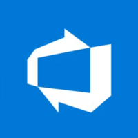

Hi there, I'm Andrés 👋
============================
### An entusiastic Full Stack Web Developer

After working as hardware technician for 7 years, I switched careers to become a Full-Stack Developer. My first role as a Software Developer within a fast-paced, agile team has provided me with a good foundation to build upon and has heightened my enjoyment and understanding of technology.

* 🌍 I'm based in Birmingham, UK
* 📜 Graduated from a 16 week intensive bootcamp at the School Of Code
* 👨🏼‍💻 Find my projects at [my portfolio](https://andres3m.github.io/personal-website/)
* ✉ Feel free to contact me at [andresmartinezuk@gmail.com](mailto:andresmartinezuk@gmail.com)
* 🌱 Learning **GO, MongoDB and LLM's integration**
* 🤝 I'm open to collaborating on anything Full-stack web-related

### Skills

  
  
  
  
  
  
  
  
  
  
  
  
  
  
  
  
  

### Socials

<!--
 -->

### Interests
* 🏄🏽‍♂️ SUP and surfing
* 🏔 Hiking
* 🏕 Camping
* 🏎 F1 and go karting
* 🏃🏽‍♂️ Running (training for my first 10k race)
* 🍓 Plants
* 🎮 Gaming

### Github Stats:
<!--  -->

