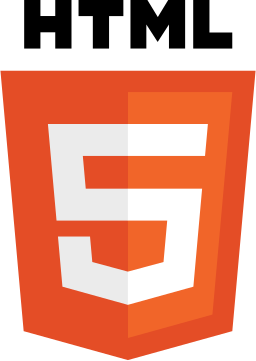
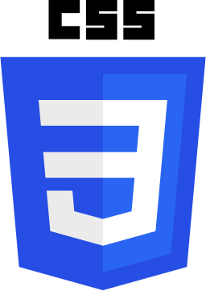
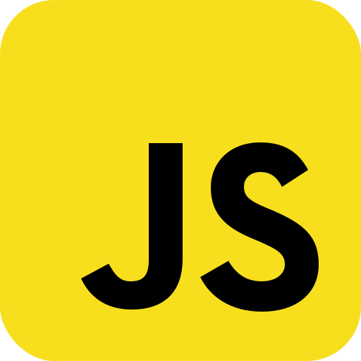
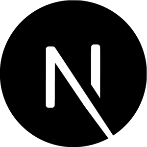
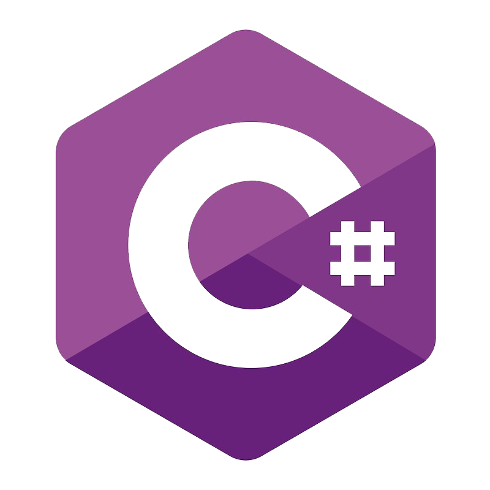
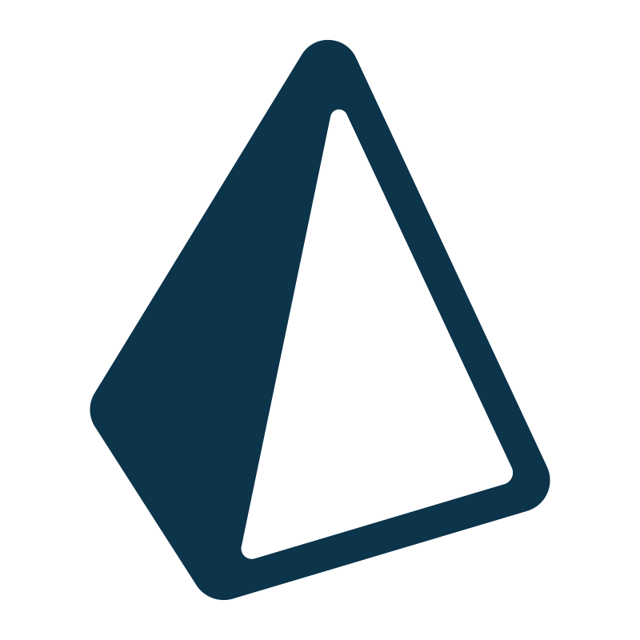
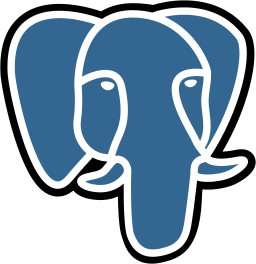
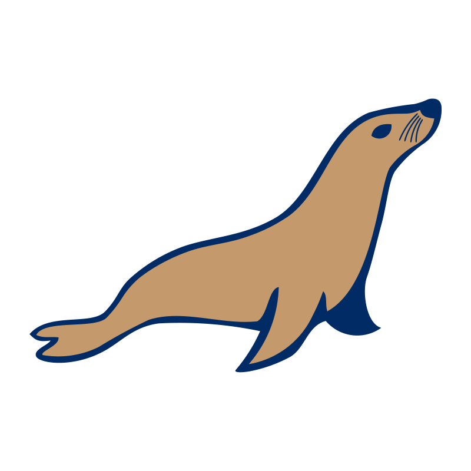
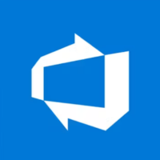

Hi there, I'm Andrés 👋
============================
### Full Stack Web Developer

Hardware roots, Web branches — 10 years of building technology with a strong foundation and a deepened passion for the craft.

* 🌍 UK Based
* 📜 Electronics Engineering and Full Stack Web Developemnt Bootcamp
* 👨🏼‍💻 Find my projects at [my portfolio](https://andres3m.github.io/personal-website/)
* ✉ Feel free to contact me at [andresmartinezuk@gmail.com](mailto:andresmartinezuk@gmail.com)
* 🌱 Curious about learning **Go, Python and LLM's**
* 🤝 I'm open to collaborating on anything Full-stack or web-related

### 🧠 Skills
<table>
  <tr>
    <th>Frontend</th>
    <th>Backend</th>
    <th>Database</th>
    <th>Testing</th>
    <th>DevOps & Tools</th>
  </tr>
  <tr>
    <td align="center">
       HTML  
       CSS  
       JavaScript  
       TypeScript  
       React  
       Next.js  
       Tailwind  
       WordPress
    </td>
    <td align="center">
       Node.js  
       C#  
       Prisma
    </td>
    <td align="center">
       PostgreSQL  
       MariaDB
    </td>
    <td align="center">
       Jest  
       Cypress
    </td>
    <td align="center">
       AWS  
       Azure DevOps  
       Git  
       Trello  
       Figma  
       Miro
    </td>
  </tr>
</table>

### Socials

<!-- -->

### Interests
* 🏃🏽‍♂️ Running -> training for my first half marathon
* 🏄🏽‍♂️ (Waves) ? Surfing : (Water) ? SUP : Surfskate
* 🏕 Camping
* 🏔 Hiking
* 🏎 Racing
  

### Github Stats:
<!--  -->

